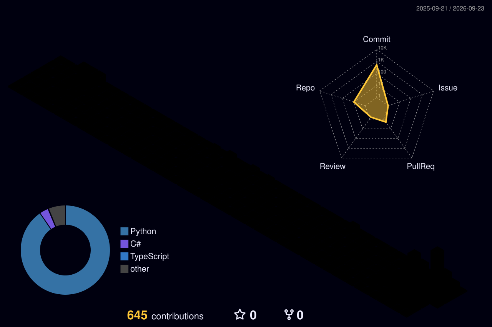

  <!-- Dynamic Gradient Header -->
  

  <!-- Readme Typing SVG -->
  

  <!-- Social Badges & Visitor Counter -->
  

    
    
    
    
  

 

### 👨‍💻 About Me

  <em>"여러 가지를 탐구하고 실전에 적용하는 것을 즐기는 유랑민 스타일 개발자입니다."</em> 
  데이터 분석, 보안, 클라우드 및 AI 기술에 깊은 관심을 가지고 있습니다.

<table align="center" width="90%">
  <tr>
    <td width="50%" align="left">
      <b>🎓 Education</b> 
      • 명지대학교 컴퓨터정보통신공학부 정보통신공학전공
    </td>
    <td width="50%" align="left">
      <b>🌱 Focus Areas</b> 
      • 클라우드 인프라 (AWS, GCP) 
      • 데이터 엔지니어링 & 분석 자동화 
      • 정보보안 및 취약점 진단, AI 응용 서비스
    </td>
  </tr>
  <tr>
    <td width="50%" align="left">
      <b>💡 Interests</b> 
      • 퀀트 트레이딩 시스템 & 자산배분 
      • 백엔드 자동화 파이프라인 
      • 모던 오픈소스 아키텍처
    </td>
    <td width="50%" align="left">
      <b>💬 Ask Me About</b> 
      • Python, Java, PostgreSQL / MySQL 
      • Docker, Linux, System Architecture 
      • Video & Media Design
    </td>
  </tr>
</table>

 

### 🛠️ Tech Stack & Toolkit

  

<b>🔍 상세 기술 스택 및 도구 카테고리별 보기 (클릭)</b>

 

<table align="center" width="90%">
  <thead>
    <tr>
      <th align="center" width="30%">분류</th>
      <th align="center" width="70%">기술 및 도구</th>
    </tr>
  </thead>
  <tbody>
    <tr>
      <td align="center"><b>Languages</b></td>
      <td align="left">
         
         
         
        
      </td>
    </tr>
    <tr>
      <td align="center"><b>Backend & DB</b></td>
      <td align="left">
         
         
        
      </td>
    </tr>
    <tr>
      <td align="center"><b>Security & Systems</b></td>
      <td align="left">
         
         
         
        
      </td>
    </tr>
    <tr>
      <td align="center"><b>Video & Design</b></td>
      <td align="left">
         
         
        
      </td>
    </tr>
    <tr>
      <td align="center"><b>Cloud & DevOps</b></td>
      <td align="left">
         
         
         
        
      </td>
    </tr>
  </tbody>
</table>

 

### 📊 GitHub Activity & Stats

<table align="center" border="0">
  <tr>
    <td align="center">
      
    </td>
    <td align="center">
      
    </td>
  </tr>
</table>

  

 

### 🧊 3D Contribution Galaxy

  

 

<!-- Dynamic Footer Wave -->

